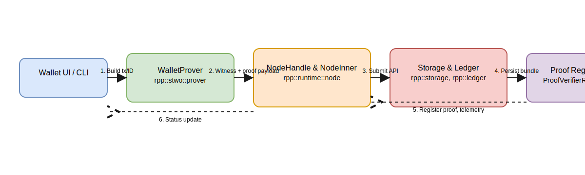
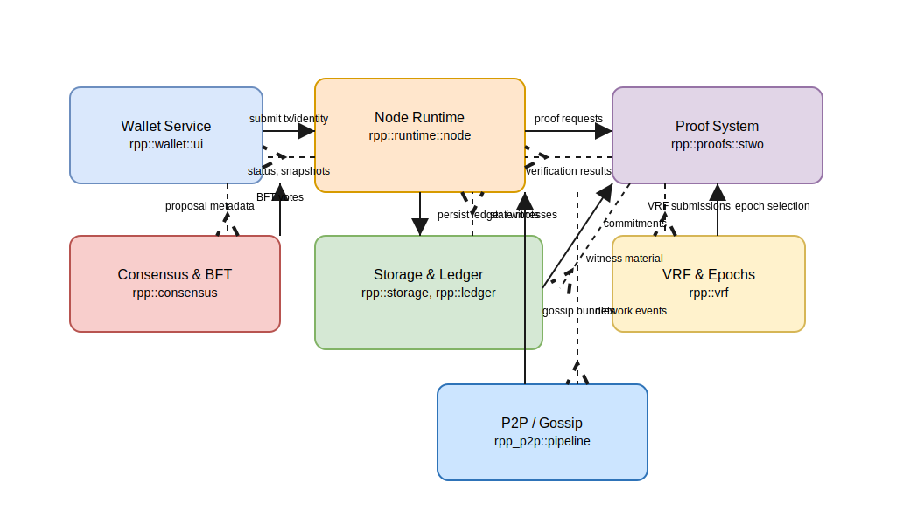

# Architekturgrundlagen

## 1. Aktueller Funktionsumfang

### 1.1 Node-Laufzeit und Konsens
- `NodeInner` bündelt Schlüsselmaterial, Ledger-State, Pruning-Kanäle und sämtliche Mempools (Transaktionen, Identitäten, Votes, Uptime, VRF) und stellt Telemetrie sowie Gossip-Anbindung bereit.【F:rpp/runtime/node.rs†L392-L420】【F:rpp/runtime/node.rs†L639-L674】
- Konsensstrukturen wie `SignedBftVote`, `ConsensusCertificate` und `ConsensusRound` kapseln BFT-Votes inklusive Malachite-basierter Gewichtung und Slashing-Evidence.【F:rpp/consensus/node.rs†L173-L263】【F:rpp/consensus/node.rs†L265-L329】

### 1.2 Wallet- und Proof-Workflow
- Die Wallet-UI orchestriert Key-Management, VRF-Audits, Node-Starts und Submit-Flows; dabei wird der `WalletProver` für Witness-Ableitung, Reputation-Checks und STWO-Proofs genutzt.【F:rpp/wallet/ui/wallet.rs†L415-L500】【F:rpp/wallet/ui/wallet.rs†L965-L1174】
- `WalletProver` generiert Identitäts-, Transaktions-, State-, Pruning- und Uptime-Zeugen direkt aus dem Firewood-Storage, prüft Tier-Schwellen und erzeugt STWO-Proof-Payloads zur Weitergabe an den Node.【F:rpp/proofs/stwo/prover/mod.rs†L40-L131】【F:rpp/proofs/stwo/prover/mod.rs†L133-L221】【F:rpp/proofs/stwo/prover/mod.rs†L223-L321】
- Typen wie `IdentityDeclaration`, `SignedTransaction` und `UptimeProof` kapseln Commitments, Signaturen und Anti-Replay-Informationen für ZSI-Integrität und Konsistenzprüfungen.【F:rpp/runtime/types/identity.rs†L17-L188】【F:rpp/runtime/types/transaction.rs†L13-L109】【F:rpp/runtime/types/uptime.rs†L11-L126】

### 1.3 Storage, Proofs und APIs
- Die Firewood-gestützte Storage-Schicht persistiert Accounts, Blöcke und Metadaten samt Pruner, während Block-Header State-/Proof-Wurzeln, VRF-Metriken und Timetoke-Deltas transportieren.【F:rpp/storage/mod.rs†L15-L139】【F:rpp/runtime/types/block.rs†L37-L149】
- `ChainProof` abstrahiert STWO-, Plonky3- und RPP-STARK-Bundles und erlaubt dem Node, Zeugen und Payloads je Backend zu verwalten.【F:rpp/runtime/types/proofs.rs†L11-L118】【F:rpp/runtime/node.rs†L120-L183】
- Das Axum-basierte HTTP-Interface exporiert Status-, Submit- und Telemetrie-Endpunkte für Wallet-, Konsens- und Uptime-Flows und greift dabei auf `NodeHandle` zu.【F:rpp/rpc/api.rs†L1-L208】【F:rpp/runtime/node.rs†L1359-L1506】

> **Hinweis (Storage-Übergang 2024):** Die ursprüngliche RocksDB-Schicht wurde durch den Firewood-Stack (append-only KV, WAL, Pruner) ersetzt. Historische Deployments erfordern daher eine Migration auf das Firewood-Schema, bevor neue Builds gestartet werden.【F:rpp/storage/mod.rs†L43-L132】【F:storage-firewood/src/kv.rs†L41-L118】

## 2. Blueprint-Ausrichtung (`Blueprint::rpp_end_to_end`)

Die folgende Übersicht spiegelt die Schlüssel aus `rpp/proofs/blueprint/mod.rs` wider und verortet vorhandene bzw. geplante Artefakte in diesem Dokument.

| SectionId / Task-Key | Beschreibung im Blueprint | Abdeckung in diesem Dokument |
| --- | --- | --- |
| `architecture.document_foundations` | Ist-Architektur dokumentieren | Kapitel 1 (Node, Wallet, Proof, Storage) sowie Sequenz-/Domänenmodelle decken die aktuellen Pfade ab. |
| `architecture.spec_interfaces` | Schnittstellen spezifizieren | Kapitel 4 beschreibt Formate & APIs, ergänzt durch Blueprint-Referenzen in Kapitel 5. |
| `firewood-stwo.state.lifecycle_api` | Lifecycle-Services extrahieren | Kapitel 5 verweist auf Firewood↔STWO-Lücken und die zugehörigen Speicher-/Proof-Flüsse. |
| `firewood-stwo.state.block_metadata` | Block-Metadaten erweitern | Kapitel 1.3 beleuchtet Header-Felder und Commitments. |
| `firewood-stwo.state.pruning_jobs` | Pruning-Proofs automatisieren | Kapitel 5 listet offene Arbeiten für Pruning-Historie. |
| `wallet-workflows.wallet.utxo_policies` | UTXO- und Tier-Policies | Kapitel 1.2 beschreibt Reputation- und Tier-Prüfungen des WalletProvers. |
| `wallet-workflows.wallet.zsi_workflow` | ZSI-ID Lifecycle | Kapitel 1.2 & Sequenzdiagramm markieren Genesis/BFT-Abläufe. |
| `wallet-workflows.wallet.stwo_circuits` | STWO-Circuits erweitern | Kapitel 1.2/1.3 verlinkt Witness-/Proof-Erstellung sowie Backend-Abstraktionen. |
| `wallet-workflows.wallet.uptime_proofs` | Uptime-Proofs integrieren | Kapitel 1.2 und Kapitel 4 führen die Nachrichtenformate & APIs auf. |
| `libp2p.p2p.integrate_libp2p` | Libp2p integrieren | Kapitel 5 nennt Gossip-Aufgaben und verweist auf Node/P2P-Interaktionen im Domänenmodell. |
| `libp2p.p2p.admission_control` | Admission-Control | Kapitel 5 dokumentiert die noch offenen Reputation-Gates auf Gossip-Ebene. |
| `libp2p.p2p.snapshot_sync` | Snapshot-Sync | Kapitel 5 markiert Synchronisationsbedarf (Node↔Storage↔P2P). |
| `vrf.poseidon_impl` | Poseidon-VRF umsetzen | Kapitel 1.1 & Kapitel 5 erfassen VRF-Mempool und Epoch-Management. |
| `vrf.epoch_management` | Epochenverwaltung | Kapitel 1.1 beschreibt `VrfEpochManager`; Lücken werden in Kapitel 5 adressiert. |
| `vrf.monitoring` | VRF-Monitoring | Kapitel 5 hebt die nötigen Telemetriepfade hervor. |
| `bft.distributed_loop` / `bft.evidence_slashing` / `bft.rewards` | BFT-Loop, Evidence & Rewards | Kapitel 1.1 und Kapitel 5 dokumentieren Konsensstatus, Evidence-Pool und Reward-Offenstände. |
| `electrs.modes` / `electrs.ui_rpc` / `electrs.validator_mode` | Electrs-Integration | Kapitel 1.2 (Wallet UI) sowie Kapitel 5 kennzeichnen die Vendor-spezifischen Pfade. |
| `lifecycle.pipeline` / `lifecycle.state_sync` / `lifecycle.observability` | End-to-End Lifecycle | Kapitel 5 adressiert Orchestrierung, Light-Clients und Observability. |
| `testing.unit` / `testing.integration` / `testing.simulation` | Test- & Validierungssuite | Kapitel 5 fasst die Test-/Simulationsanforderungen zusammen. |

## 3. Sequenz- und Domänenmodelle

- **Wallet → Node Sequenzfluss:** `docs/architecture/wallet_node_sequence.drawio` / `wallet_node_sequence.svg`

  

- **Domänenmodell RPP Runtime:** `docs/architecture/rpp_domain_model.drawio` / `rpp_domain_model.svg`

  

Die Diagramme verdeutlichen die Abfolge von Wallet-basierten Submit-Flows sowie die Systemgrenzen zwischen Runtime, Proof-Backends, Storage, Konsens, VRF und Netzwerk, passend zu den Blueprint-Schlüsseln `architecture.document_foundations` und `architecture.spec_interfaces`.

## 4. Nachrichten- und Schnittstellenspezifikation

### 4.1 Datenformate
- **Transaction**: Enthält Absender, Empfänger, Betrag, Fee, Nonce, optionales Memo und Timestamp; Hash und kanonische Bytes basieren auf JSON-Encoding.【F:rpp/runtime/types/transaction.rs†L15-L56】
- **SignedTransaction**: Bindet die Transaktion an eine Ed25519-Signatur samt öffentlichem Schlüssel und UUID, inklusive Verifikationsroutine.【F:rpp/runtime/types/transaction.rs†L60-L95】
- **IdentityDeclaration**: Kombination aus `IdentityGenesis` (PK, VRF-Tag, State-/Identity-Root, Commitment-Proof) und `IdentityProof` (Commitment + ChainProof).【F:rpp/runtime/types/identity.rs†L17-L55】
- **BlockHeader**: Trägt Höhenangabe, Hash des Vorgängers, Wurzeln für Transaktionen/State/UTXO/Reputation/Timetoke/ZSI/Proofs sowie VRF-Schlüssel, VRF-Proof und Proposer-Metadaten.【F:rpp/runtime/types/block.rs†L38-L113】
- **BlockProofBundle**: Aggregiert Transaktions-, State-, Pruning- und Recursive-Proofs und kapselt Backend-spezifische Artefakte über `ChainProof`.【F:rpp/runtime/types/proofs.rs†L11-L94】
- **UptimeProof**: Speichert Commitment über Online-Fenster, optionale Meta-Daten (Node-Uhr, Epoch, Head-Hash) und den ZK-Proof.【F:rpp/runtime/types/uptime.rs†L10-L114】

### 4.2 Zustands- & Service-Schnittstellen
- **ProofProver / WalletProver**: Liefert Zeugen für Identität, Transaktion, State, Pruning und Uptime über lokale Storage-Snapshots, inklusive Reputation-Gewichtung und Tier-Schwellen.【F:rpp/proofs/stwo/prover/mod.rs†L42-L179】
- **NodeHandle**: Bietet Status- und Submit-Methoden für Transaktionen, Identitäten, Votes und Uptime-Proofs und dient als API-Backbone für das HTTP-Interface.【F:rpp/runtime/node.rs†L1359-L1506】【F:rpp/rpc/api.rs†L1-L195】
- **Consensus-Zertifikate & Votes**: Definieren Nachrichtenbytes für PreVote/PreCommit, Hashing- und Verifikationspfade für Ed25519-gestützte Signaturen sowie Aggregationsmetriken.【F:rpp/consensus/node.rs†L169-L233】

## 5. Nächste Schritte für Architekturangleichung
1. **`firewood-stwo.state.lifecycle_api` & `state.pruning_jobs`:** Schnittstellen zwischen Storage, Ledger und Proof-System modularisieren (Block-/Pruning-Jobs automatisieren, Lifecycle-Services versionieren).
2. **`wallet-workflows`-Tasks:** UTXO/Tier-Policies finalisieren, ZSI-Attestierungsflow dokumentieren und Uptime-Proofs end-to-end testen.
3. **`libp2p` & `vrf` Tasks:** Gossip-Admission-Control, Snapshot-Sync sowie Epoch-/VRF-Verteilung an den Sequenzfluss ankoppeln und Telemetrie ausbauen.
4. **`block-lifecycle` & `testing`:** Pipeline-Orchestrierung für Blockproduktion vs. Light-Client-Sync beschreiben und Test-/Simulationsabdeckung nach Blueprint-Anforderungen ausweiten.
